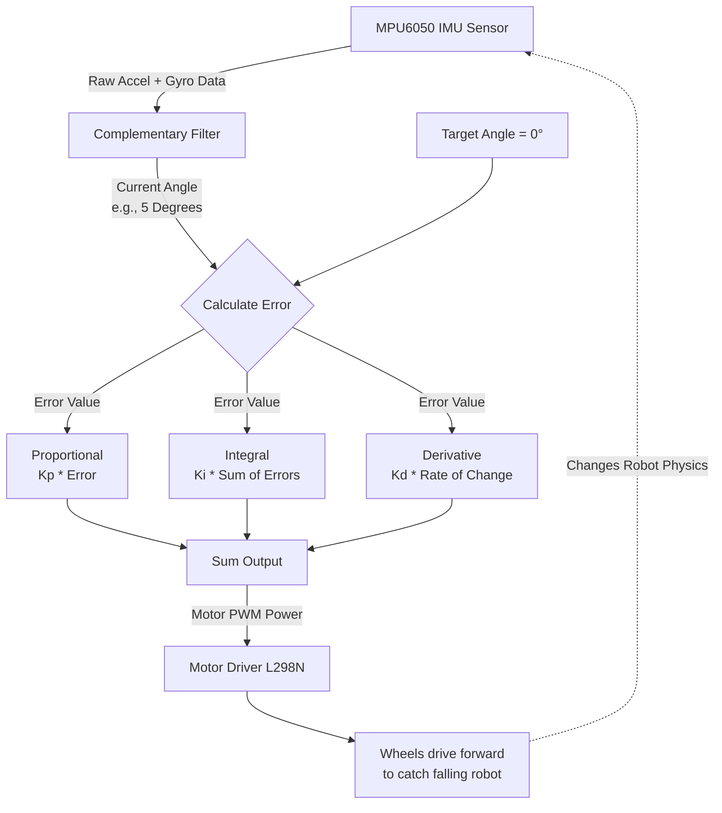

# Self-Balancing Robot (Inverted Pendulum)

## Overview
This project controls a two-wheeled self-balancing robot using an Arduino, an MPU6050 (Accelerometer + Gyroscope), and a standard L298N Motor Driver. It relies on a PID control loop to calculate the exact motor speed required to counteract gravity.

## Logical Flow

> **Excalidraw Integration:** Copy the Mermaid code block below, go to [excalidraw.com](https://excalidraw.com), click on **Insert** -> **Mermaid**, and paste the code to generate the system architecture diagram.

## How to Tune the Robot
Tuning a self-balancing robot is notoriously tricky. Follow these steps:
1. **Kp (Proportional) only:** Set Ki and Kd to 0. Increase Kp until the robot starts oscillating back and forth rapidly (it shouldn't fall flat, but it will shake).
2. **Kd (Derivative) next:** Slowly increase Kd. The derivative acts like a "shock absorber." It will dampen the violent shaking from the Kp value and make the robot stand relatively still.
3. **Ki (Integral) last:** If the robot is balancing but slowly drifting in one direction across the floor, add a tiny amount of Ki (e.g., 0.1 to 0.5) to correct the long-term drift.
